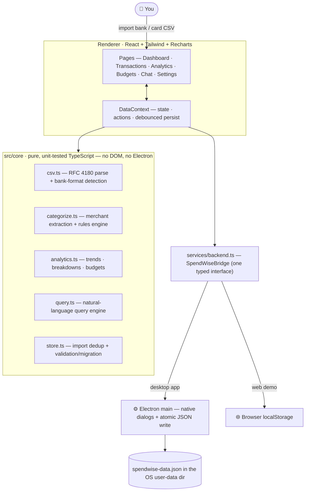

# SpendWise Desktop

[](https://shreyas463.github.io/spendwise-desktop/)
[](https://github.com/shreyas463/spendwise-desktop/actions/workflows/deploy-pages.yml)
[](LICENSE)

A **local-first** cross-platform desktop app for personal finance. Import your bank and credit-card CSV exports, get automatic transaction categorization, interactive spending analytics, budgets with alerts, and a chat interface that answers plain-English questions about your money — all computed on your machine. **No account, no server, no cloud. Your data never leaves your computer.**

## 🌐 Live demo

**[shreyas463.github.io/spendwise-desktop](https://shreyas463.github.io/spendwise-desktop/)** — the full UI running in your browser. Click **Load demo data** to explore the dashboard, analytics, budgets, and chat with a realistic dataset.

> The demo is the same renderer as the desktop app, with browser `localStorage` standing in for on-disk storage — so anything you add lives only in your own browser. For real use, run the desktop app (below), which stores your data as a file on your machine.

## ✨ Features

- **CSV import with format detection** — handles signed-amount and debit/credit column layouts, `MM/DD/YYYY` / `DD/MM/YYYY` / ISO / text dates, quoted fields, `$1,234.56` and European `1.234,56` amounts, accounting `(45.00)` negatives, and comma/semicolon/tab delimiters. Re-importing the same file never creates duplicates.
- **PDF statement import** — drop in a bank or credit-card PDF and SpendWise extracts *only* the transaction rows (a leading date + a trailing amount), discarding addresses, headers, page numbers, marketing, and running totals. It detects running-balance columns, reads sections/parentheses/`CR`·`DR` to sign each amount, and feeds the same categorize → de-duplicate → store pipeline as CSV. Works on text-based PDFs (not scanned images), fully offline.
- **Automatic categorization** — ~150 built-in merchant rules (Whole Foods → Groceries, SQ \*Blue Bottle → Dining, …) plus your own rules, which always win and can re-categorize existing history. Messy statement text like `SQ *BLUE BOTTLE COFFEE #442` becomes a clean merchant name, "Blue Bottle Coffee".
- **Dashboard** — monthly spend / income / net KPIs with month-over-month deltas, category donut, 6-month trend, budget snapshot, recent activity.
- **Analytics** — category breakdown, monthly spend + transaction-count composed chart, stacked category mix over time, top merchants; each chart exports to CSV. 3/6/12-month ranges.
- **Budgets** — monthly limits per category with on-track / approaching / over states, inline limit editing, and an over-budget badge in the sidebar.
- **Chat with your data** — ask "What did I spend on groceries last month?", "Top merchants this year", "Compare dining vs groceries", "How are my budgets doing?" and get instant, deterministic answers computed from your local data (no LLM, no network).
- **Transactions** — search, filter, paginate, inline category editing, one-click "create rule from this transaction", manual entry, CSV export.
- **Theming & settings** — light / dark / system theme, multi-currency display, JSON backup export, demo dataset for trying the app.

## 🏗 Architecture

SpendWise is intentionally simple: **one Electron app, zero services**. The same renderer ships as the desktop app and as the static web demo; only the storage backend differs.



Everything in `src/core` is dependency-free TypeScript — no DOM, no Electron — so it runs identically in the app, in a plain browser, and under Vitest. The renderer talks to its host through a single typed bridge (`src/services/backend.ts`) that falls back to `localStorage` in a browser, which is what lets the entire UI be developed, tested, and demoed without launching Electron (`npm run dev:web`).

**Typical flow:** a CSV import runs through `csv.ts` (parse + detect format) → `categorize.ts` (merchant + category) → `store.ts` (de-duplicate against existing history) into `DataContext`, which persists via the bridge. The pages read that state back through `analytics.ts` and `query.ts` to render charts and answer questions — all synchronous, in-memory, on your machine.

> **Why no database/microservices?** Earlier iterations of this project ran five Spring Boot services, PostgreSQL, and a local LLM via Docker. For a single-user desktop app that's pure operational overhead: a JSON document (atomically written, validated and migrated on load) comfortably handles tens of thousands of transactions, keeps the install a single binary, and makes "local-first privacy" literally true.

## 🚀 Getting started

### Prerequisites

- Node.js 18+ (that's it — no Java, no Docker, no Postgres, no Ollama)

### Run in development

```bash
npm install
npm run dev        # launches Vite + the Electron app with hot reload
```

Or develop the UI in a plain browser (localStorage-backed):

```bash
npm run dev:web    # http://localhost:5173
```

Try it out with the **Load demo data** button on the dashboard, or import the files in [sample-data/](sample-data/).

### Tests & checks

```bash
npm test           # Vitest unit suite (CSV parsing, categorization, analytics, NL queries)
npm run typecheck  # strict TypeScript
npm run lint       # ESLint
```

### Package for distribution

```bash
npm run build      # typecheck + build + electron-builder
                   #   macOS: DMG · Windows: NSIS installer · Linux: AppImage
npm run build:dir  # fast unpacked build (release/) for local smoke-testing
```

### Web demo deployment

The browser demo is published to GitHub Pages automatically on every push to `main` by [`.github/workflows/deploy-pages.yml`](.github/workflows/deploy-pages.yml), which runs the test suite and then builds the static bundle with `npm run build:web`. To host it elsewhere, run `BASE_PATH=/your-subpath/ npm run build:web` and serve the resulting `dist/`.

## 📄 Importing statements (CSV & PDF)

**CSV** — SpendWise auto-detects columns by header name. It needs at minimum a **date**, a **description**, and either an **amount** column (negative = money out) or a **debit**/**credit** pair. Extra columns are ignored. See [sample-data/](sample-data/) for two differently-shaped examples (a US bank export and a semicolon-delimited European credit-card export).

**PDF** — the extractor (PDF.js, running locally) turns the document back into lines, then a heuristic parser keeps only lines that look like transactions (leading date + trailing amount). It infers the date format and statement year, detects a running-balance column so it never mistakes the balance for the amount, and signs each amount from section headers (“Deposits”/“Purchases”), inline markers (`( )`, trailing `-`, `CR`/`DR`), or income keywords. Best with text-based statements; scanned/image-only PDFs can’t be read (export a CSV instead). After any import you can fix a category inline or delete a row, so odd cases are easy to correct.

## 🔒 Privacy

All data lives in a single JSON document in your OS user-data folder (e.g. `~/Library/Application Support/SpendWise/` on macOS). The desktop app makes no network requests. Backup and restore is a file copy — or use *Settings → Export backup*.

## 📜 License

MIT
